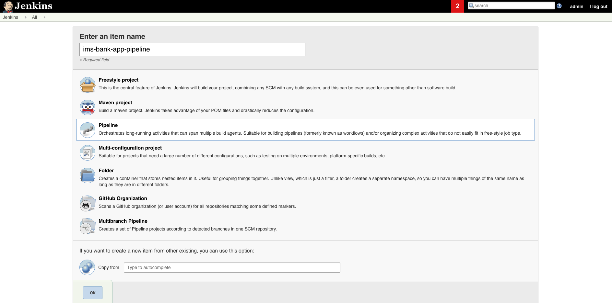
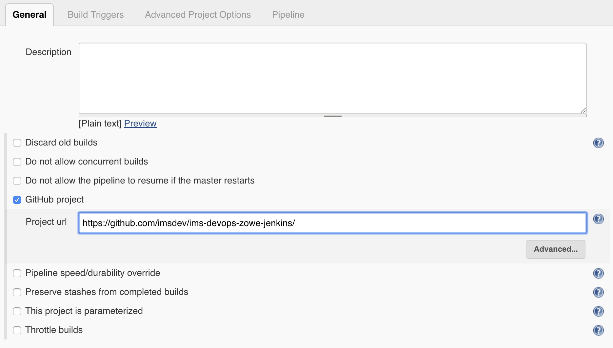
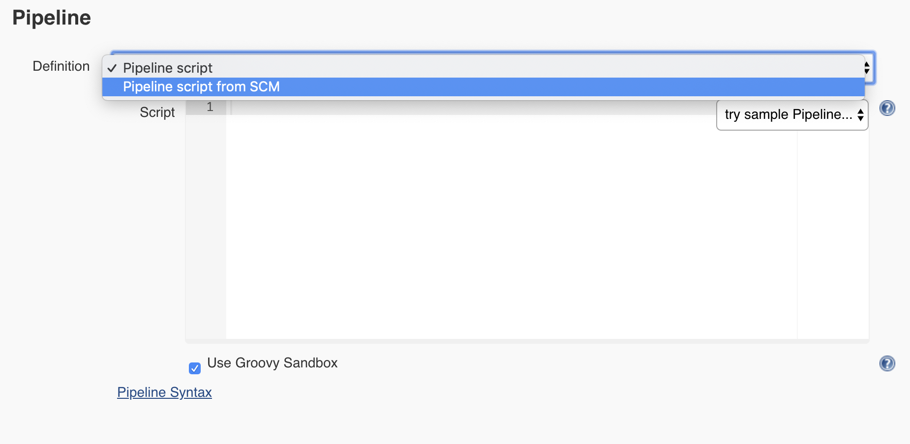
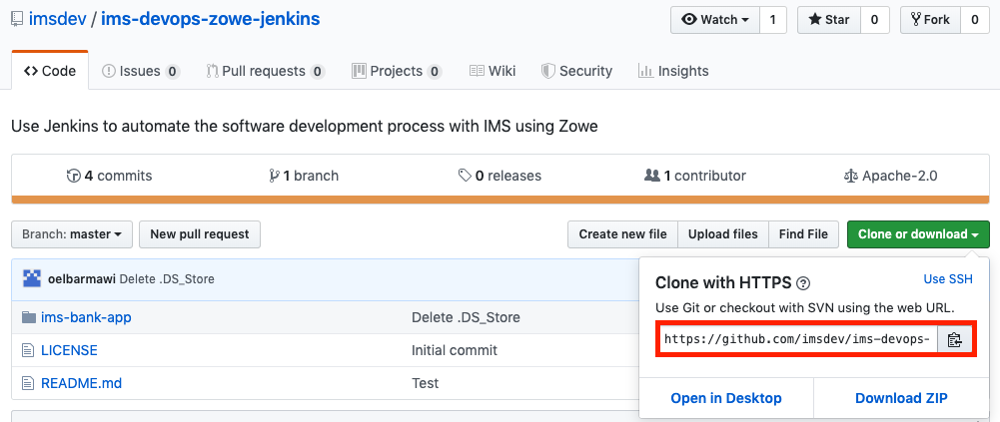
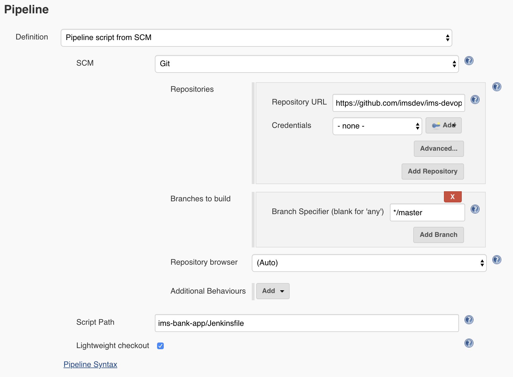

# IMS Devops Zowe Jenkins Pipeline

In this tutorial, we will create a Jenkins pipeline that will automate the process of compiling and deploying COBOL code stored in a Github repository.

## Requirements 
Jenkins  
Zowe  

## Set up Jenkins Pipeline
We will start navigating to the home screen of Jenkins and selecting **New Item**. From there, enter an item name and select **Pipeline** as the project type as shown in the screenshot below. Click **OK**.
  

Now you will be taken to the configuration page for your newly created pipeline. In the General tab, check the box next to **Github project** and paste the URL of your project's github repository in the text field provided.
  

Scroll down to the Pipeline tab, and next to **Definition**, click on the dropdown menu and select **Pipeline script from SCM**. Selecting this indicates to your Jenkins pipeline that there will be a Jenkinsfile in your repository that will define how the pipeline will run and how it will be separated into separate stages.
  

You will now see an expanded view of the Pipeline tab. Next to **SCM** click on the dropdown menu and select **Git**. You will now need to provide the Repository URL (shown in the screenshot below) and any credentials if applicable.
  

Specify the branch in which you want your Jenkins build to run on, and in the text field next to **Script Path**, make sure to provide the correct path to your Jenkinsfile in the Github repository.

Select **Save** at the bottom of the page. Your Jenkins pipeline is ready to build and deploy your COBOL code!
